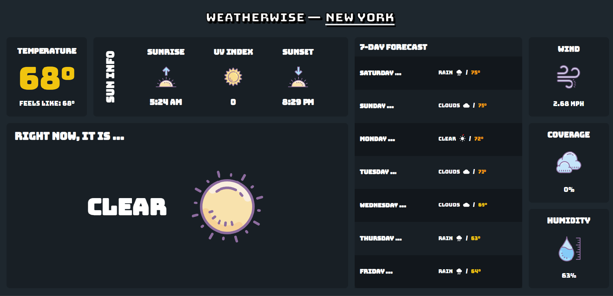

Weatherwise is an application developed using React and TypeScript that leverages the OpenWeatherAPI to provide current and future weather forecasts based on the user's location or a manually entered location.

## Features

1. **Real-time Weather Data**: Fetches real-time weather data based on user's location or a searched location. It provides key weather details like temperature, 'feels like' temperature, wind speed and direction, humidity, UV index, and cloud coverage.
2. **7-Day Weather Forecast**: Gives a comprehensive 7-day forecast. Each day includes the expected weather conditions, represented with appropriate icons and the expected temperature.
3. **User-friendly Search Functionality**: Allows users to search for weather data for any global location.
4. **Dynamic Weather Icons**: Visual representation of the weather conditions using dynamic icons, enhancing the user experience.
5. **Responsive Design**: The application is fully responsive, delivering an optimal experience across various devices and screen sizes.

## Technologies

- React (with Hooks and Context API)
- TypeScript
- OpenWeatherMap API
- Axios for data fetching
- Styled-components for styling
- Lottie for animations
- Use of browser Geolocation API
- MUI Icons for weather representation

## Structure

- **App**: The main application component. It manages the state of the application and determines the components to render based on the state.
- **Title**: Displays the application title and a search bar to find weather data for any location.
- **Info**: A component that displays the detailed current weather data.
- **Day**: A component used to render each day of the 7-day forecast. The weather conditions for each day are represented with appropriate icons using MUI Icons.
- **LocationProvider**: A context provider that handles the fetching of location and weather data and provides it to other components through React's Context API.
- **Splash**: Displays a splash screen while the application is fetching data.

## Future Developments

- Addition of a feature to switch between Celsius and Fahrenheit temperature units.
- Improve error handling, particularly for scenarios where data fetching fails.
- Provide more customization options for users, such as changing themes.
- Improve handling and security of API calls.
